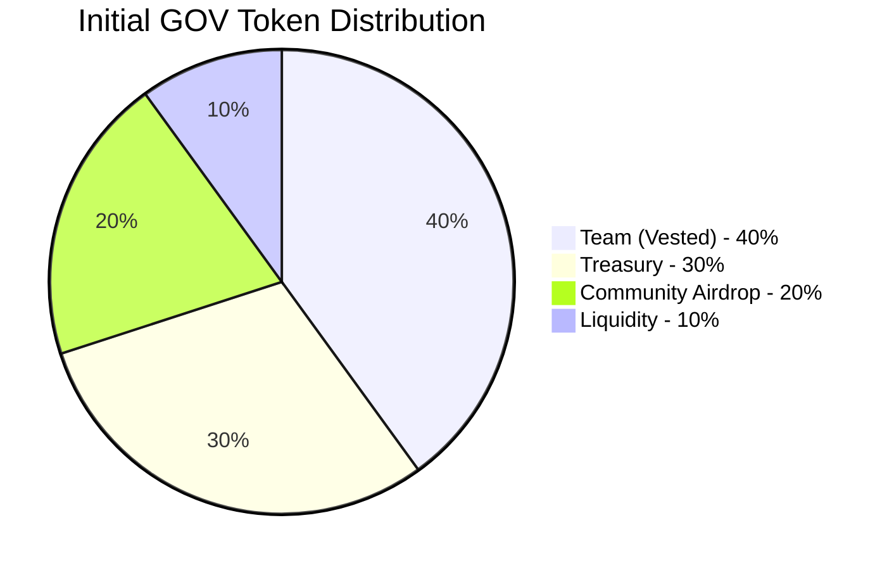
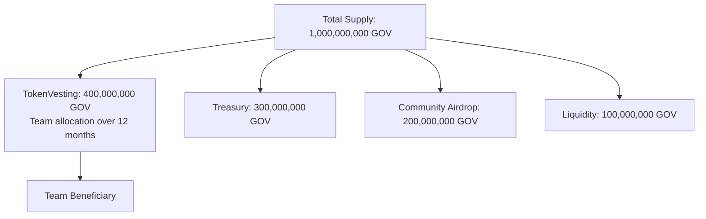

# Token Distribution Diagram

```mermaid
pie title Initial GOV Token Distribution
    "Team (Vested) - 40%" : 40
    "Treasury - 30%" : 30
    "Community Airdrop - 20%" : 20
    "Liquidity - 10%" : 10
```

```mermaid
flowchart TD
    A[Total Supply: 1,000,000,000 GOV] --> B[TokenVesting: 400,000,000 GOV\nTeam allocation over 12 months]
    A --> C[Treasury: 300,000,000 GOV]
    A --> D[Community Airdrop: 200,000,000 GOV]
    A --> E[Liquidity: 100,000,000 GOV]
    B --> F[Team Beneficiary]
```
